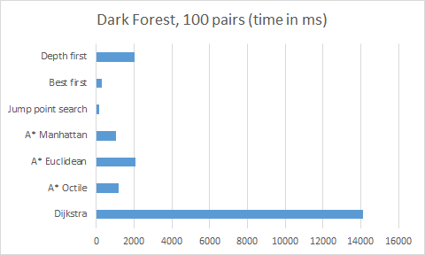
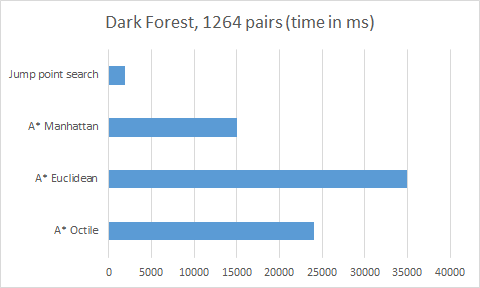
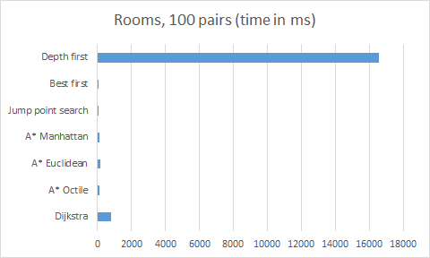
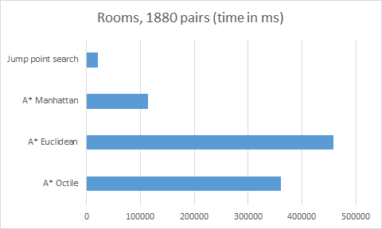
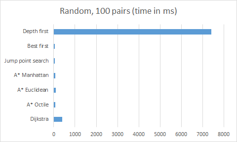
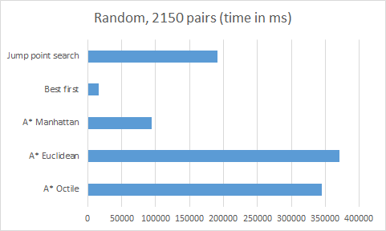

# Toteutusdokumentti

## Rakennetta lyhyesti
Renderer-luokka toimii löyhästi God-luokkana. Siellä säilytetään joka hetki
kyseistä "modea" esim Edit, Visualize tai Run.

Input-luokka nimensä mukaan kuuntelee käyttäjän syötettä, eli hiiren klikkauksia
ja vetämistä ja muuttaa Renderer-luokan "modea" tai suoraan manipuloi Gridiä.

Grid luokka kuvaa verkkoa tai sokkeloa, jossa polunetsintä suoritetaan. Grid
koostuu 2D arraystä Node-luokan instansseja.

Node-luokka esittää yhtä solmua, joka pitää sisällään sijaintia, väriä ja
itse polunetsintään liittyvää tietoa.

Visualizer-luokka visualisoi polunetsintää.

Finder on abstrakti luokka jonka kaikki polunetsintäalgoritmit toteuttavat.

## Saavutetut aika-ja tilavaativuudet

Aikavaativuudet vastaavat määrittelydokumentin vaativuuksia. Algoritmit ovat
yleisiä ja niiden toteuttamisessa ei ollut ongelmia, joten uskoisin, että
tavoitelluissa aika- ja tilavaativuuksissa pysyttiin. Teoreettiset aika- ja
tilavaativuudet eivät ole kovin hyödyllisiä tähän projektiin, sillä algoritmit
toimivat lähinnä heuristisesti, jolloin parempi heuristiikka nopeuttaa algoritmin
toimintaa vain käytännössä, ei aikavaativuuksissa.

## Suorituskykyvertailu

Suorituskykyvertailuun valitsin suorituskykytestaukseen kolme eri pohjaa.
Kaikki pohjat ovat ladattu [pathfinder benchmarking nettisivulta](http://www.movingai.com/benchmarks/).

Pohjiksi valitsin:
  - Warcraft III -pelin kentän "Dark Forest" (darkforest.map),
  - 16x16 huoneita, jossa 80 % ovista on auki (16room_004.map)
  - Satunnaisesti generoituja esteitä (random512-35-4.map)

Kaikki pohjat ovat 512x512 kokoisia ja pohjien mukana tuli paljon aloitus ja
lopetuspisteitä. Testauksessa suoritan aluksi 100 ensimmäistä alku- ja loppupiste
paria. Lopuksi vertailen vielä jump point search ja A\* algoritmeja keskenään
kaikilla pareilla.

### Dark Forest

**100 paria**

Algoritmi         | Aika (millisekunneissa)
------------------|------------------------
Dijkstra          |	14133
A\* Octile	      | 1190
A\* Euclidean	  | 2078
A\* Manhattan	  | 1021
Jump point search |	121
Best first	      | 270
Depth first	      | 2001

**1262 paria**

Algoritmi         | Aika (millisekunneissa)
------------------|------------------------
A\* Octile	      | 24027
A\* Euclidean	  | 34958
A\* Manhattan	  | 14982
Jump point search |	1876

### Rooms

**100 paria**

Algoritmi         | Aika (millisekunneissa)
------------------|------------------------
Dijkstra	      | 792
A\* Octile	      | 121
A\* Euclidean	  | 146
A\* Manhattan	  | 126
Jump point search | 22
Best first	      | 59
Depth first	      | 16558

**1880 paria**

Algoritmi         | Aika (millisekunneissa)
------------------|------------------------
A\* Octile	      | 361276
A\* Euclidean	  | 458035
A\* Manhattan	  | 113979
Jump point search |	20933

### Random obstacles

**100 paria**

Algoritmi         | Aika (millisekunneissa)
------------------|------------------------
Dijkstra          |	392
A\* Octile	      | 78
A\* Euclidean	  | 94
A\* Manhattan	  | 75
Jump point search | 44
Best first	      | 44
Depth first	      | 7404

**2150 paria**

Algoritmi         | Aika (millisekunneissa)
------------------|------------------------
A\* Octile	      | 344739
A\* Euclidean	  | 371076
A\* Manhattan	  | 94536
Best first	      | 16397
Jump point search |	191311

### Tulokset

Tulokset olivat melko odotettuja. Dijkstra on merkittävästi hitaampi kuin
A\* millä tahansa heuristiikalla. Toisaalta A\* octile heuristiikka oli
odotettavasti poikkeuksetta Euclidean distancea nopeampi. Tämä edelleen johtuu
siitä, että Euclidean distance tarkastelee useampia solmuja kuin octile ja lisäksi
vielä joutuu laskemaan joka kerta neliöjuuren joka on raskaampi kuin lineaariset
operaatiot. Manhattan distance ja Best-first heuristiikat olivat pääosin nopeampia
kuin octile. Tämäkin oli odotettavissa, sillä kumpikaan näistä ei löydä välttämättä
lyhyintä reittiä, niin ne usein oikaisevat hieman.

Uusi lisäys jump point search (octile distance) oli selvästi nopein algoritmi ja
kaiken kukkuraksi se löytää aina lyhyimmän reitin. Onkin ilmiselvää, että
tämän suorituskykytestauksen pohjissa jump point search on erittäin vahvoilla.
Esimerkiksi Dark Forest -pohjan kaikilla pareilla jump point search oli noin 17
kertaa nopeampi kuin vastaava A\* (octile) ja huone-pohjassa vastaavasti noin 13
kertaa nopeampi.

## Puutteet ja parannusehdotukset

Hauska ominaisuus olisi se, että käyttäjä voisi ladata sivulle oman ASCII-merkkisen
sokkelon, jonka sivu voisi ratkaista ja visualisoida.

Sivu tukee tällä hetkellä vain neliöverkkoja, joten se rajoittaa ainakin osin
ratkaistavia verkkoja.

## Lähteet
[Wiki Dijkstra](https://en.wikipedia.org/wiki/Dijkstra%27s_algorithm)

[Wiki A\*](https://en.wikipedia.org/wiki/A*_search_algorithm)

[A\* Heuristics](http://theory.stanford.edu/~amitp/GameProgramming/Heuristics.html)

[Benchmark data](http://www.movingai.com/benchmarks/)
